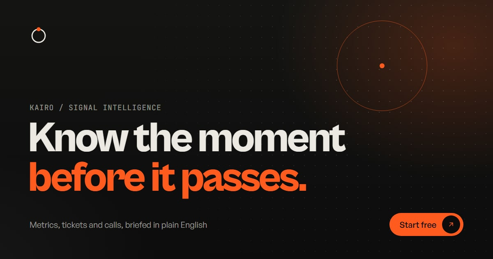

# Kairo: Astro SaaS Template

[](https://vercel.com/new/clone?repository-url=https%3A%2F%2Fgithub.com%2FStaticMania%2Fkairo-astro-templete&project-name=kairo-astro&repository-name=kairo-astro) [](https://app.netlify.com/start/deploy?repository=https://github.com/StaticMania/kairo-astro-templete)

**Live demo:** [kairo-astro.vercel.app](https://kairo-astro.vercel.app)



A cinematic, motion-heavy SaaS marketing template built with Astro, Tailwind CSS v4 and GSAP. It ships with a demo brand (Kairo, a fictional signal-intelligence product) so the preview looks real, and every word, link, number and image comes from data files you can edit without touching a component.

## Highlights

- **Home loader** with booting data modules, a drawing ring, a photo lens and an iris reveal. The ring then flies into the nav logo.
- **Page transitions**: staggered columns with the destination name, on a normal multi-page site (no client router).
- **Hero**: live canvas signal field that reacts to the cursor, a rotating customer slideshow and rolling NumberFlow metrics.
- **Scroll stories**: a pinned three-act product story, a tabbed 3D card deck, a horizontal case-study pan and a draggable 3D testimonial ring.
- **Micro-interactions** everywhere: text roll links, magnetic buttons, an interactive signal line, a cursor-following view chip and a footer wordmark that lifts toward the cursor.
- **Accessible by default**: one shared reduced-motion switch, focus states, keyboard support on sliders, toggles and accordions, and semantic markup.
- **SEO ready**: per-page titles, descriptions, canonical URLs and generated Open Graph images.

## Pages

| Route               | What it is                                    |
| ------------------- | --------------------------------------------- |
| `/`                 | Home                                          |
| `/customers`        | Customer stories with filters                 |
| `/customers/[slug]` | Story detail (from Markdown)                  |
| `/pricing`          | Plans, comparison table, FAQ and a sales form |
| `/journal`          | Blog index with a cursor-follow preview list  |
| `/journal/[slug]`   | Article detail (from Markdown)                |
| `/about`            | Story, timeline, values, team and open roles  |
| `/404`              | Not found page                                |

## Tech stack

Astro 7, Tailwind CSS 4, GSAP 3 (ScrollTrigger, SplitText, Flip), Lenis smooth scroll, NumberFlow, Phosphor icons and TypeScript. Bun is used in the examples, but npm, pnpm and yarn work too.

## Quick start

```bash
bun install
bun run dev
```

Open `http://localhost:4321`.

| Command           | Action                              |
| ----------------- | ----------------------------------- |
| `bun run dev`     | Start the dev server                |
| `bun run build`   | Build the static site into `dist/`  |
| `bun run preview` | Preview the production build        |
| `bun run check`   | Type-check `.astro` and `.ts` files |
| `bun run format`  | Format with Prettier                |

## Project structure

There is no `src/` folder. The project root is the source directory and `@/` points to it.

```
assets/images/         Photos used by the site (optimised by astro:assets)
public/                Favicon, logo and Open Graph images (served as-is)
pages/                 Routes. Each page only composes sections.
layouts/layout.astro   HTML shell: meta tags, loader, transition, navbar, footer
components/
  home/ customers/ customers-details/ journal/ journal-details/ pricing/ about/
                       One section per file, grouped by page
  shared/              Layout parts (navbar, menu, footer, loader), UI parts and icons
  animation/           main.ts boots every behaviour in animation/init/*.ts
data/                  All content: site config, copy, lists, Markdown collections
interface/index.ts     Shared TypeScript types
scripts/og/            Open Graph image generator
styles/                Design tokens, typography and shared CSS
utils/                 Small helpers
content.config.ts      Schemas for the customers and journal collections
```

## Make it yours

### 1. Brand

Edit `data/site.ts`. This is the only file you need for a basic rebrand.

```ts
export const site = {
  name: 'Kairo', // logo, footer wordmark, page titles
  legalName: 'Kairo Labs, Inc.', // footer copyright
  url: 'https://your-domain.com', // canonical URLs and OG images
  title: 'Kairo - Know the moment before it passes',
  description: 'Default meta description',
  email: 'hello@kairo.app',
  careersEmail: 'careers@kairo.app',
  accent: '#ff5b1f', // the one accent colour used everywhere
  cta: {
    primary: { label: 'Start free', href: '/pricing#sales' },
    secondary: { label: 'Book a demo', href: '/pricing?intent=demo#sales' },
  },
  socials: [/* label, href, icon: 'x' | 'linkedin' | 'github' */],
};
```

The navbar logo, the footer wordmark (it resizes to fit any name length), the page transition label, every page title and both call-to-action buttons read from here.

### 2. Colours

- The accent colour is set in `data/site.ts` and applied at runtime, so changing it there is enough.
- The rest of the palette (backgrounds, text and lines) lives in `styles/variables.css` as Tailwind theme tokens such as `--color-ink` and `--color-bone`.
- The favicon is `public/favicon.svg`. Update its two colours to match.

### 3. Fonts

Fonts are loaded with Astro's built-in font API in `astro.config.ts` (Cabinet Grotesk and General Sans from Fontshare, JetBrains Mono from Google). To swap a font, change its `name` and `provider` there. The CSS variable names stay the same, so nothing else needs to change.

### 4. Copy

| File              | What it controls                                                                                                                   |
| ----------------- | ---------------------------------------------------------------------------------------------------------------------------------- |
| `data/home.ts`    | Hero, logo strip label, manifesto, product story, capabilities, how-it-works title, stories intro, testimonials title, closing CTA |
| `data/hero.ts`    | Hero slideshow slides and the floating portrait                                                                                    |
| `data/loader.ts`  | Loader module names, counts, status words, captions and photos                                                                     |
| `data/steps.ts`   | The three how-it-works cards and the brief preview                                                                                 |
| `data/proof.ts`   | Testimonials and their result metrics                                                                                              |
| `data/logos.ts`   | Customer logo strip and integration icons                                                                                          |
| `data/pricing.ts` | Plans, comparison table and FAQ                                                                                                    |
| `data/pages.ts`   | Page heroes, meta descriptions and labels for customers, story, pricing, journal, about and 404                                    |
| `data/about.ts`   | Timeline, values, team and open roles                                                                                              |
| `data/navbar.ts`  | Navigation links and page transition labels                                                                                        |
| `data/footer.ts`  | Footer link groups, newsletter copy and legal line                                                                                 |

### 5. Customer stories and journal posts

Both are Markdown collections. Add, edit or delete files and the list pages, detail pages, filters and "next" links update automatically.

- `data/customers/*.md` fields: `order`, `client`, `industry`, `title`, `summary`, `cover`, `gallery` (two images), `year`, `team`, `results` (three items with `value` and `label`) and `quote`.
- `data/journal/*.md` fields: `title`, `excerpt`, `category`, `date`, `readTime`, `cover`, `author` (`name`, `role`, `image`) and `featured` (optional).

The schemas are in `content.config.ts`. Values like `-34%`, `$1.3M` or `5 days` roll in with NumberFlow automatically.

### 6. Images

Put photos in `assets/images/` and reference them as `/images/your-file.jpg` in data files or front matter. Astro optimises them into responsive WebP at build time. Roughly 2000px wide is plenty for full-bleed images and 1400px for portraits and cards.

The demo photos come from [Lummi](https://www.lummi.ai/license) and are **not covered by the MIT License**. Lummi's licence allows free personal and commercial use, including in templates, without attribution, but you may not resell the photos on their own or bundle them into a stock image site or competing service. Swap in your own images whenever you like.

### 7. Logos and integrations

`data/logos.ts` uses neutral placeholder marks (`components/shared/icons/logo-mark.astro`) and generic Phosphor icons for integrations. To show real customer logos, add the SVGs you have permission to use and swap `LogoMark` for an `` in `components/home/logos.astro`.

### 8. Forms

The newsletter and sales forms are front-end only. They validate input, show loading, success and error states, and then simulate a response. To make them live, replace the `setTimeout` in `components/animation/init/newsletter.ts` and `components/animation/init/sales-form.ts` with a `fetch` to your form service (Formspree, Basin, a serverless function or your own API).

### 9. Motion

Each behaviour lives in its own file in `components/animation/init/` and is loaded automatically by `components/animation/main.ts`.

- **Reduced motion**: visitors with "reduce motion" turned on get a static, fully readable site. Nothing extra to configure.
- **Turn off the home loader**: remove the `preloader` prop from `<Layout preloader>` in `pages/index.astro`.
- **Turn off page transitions**: delete `components/animation/init/transition.ts`.
- **Hidden start states** for animated elements are defined inline in `layouts/layout.astro` to avoid any flash of content.

### 10. SEO and Open Graph images

Each page passes its own `title`, `description` and `image` to the layout. Share images live in `public/images/og/`. After changing your brand or content, regenerate them all (needs Chrome or Edge installed):

```bash
node scripts/og/generate-all.mjs --force
```

It reads the brand name and accent from `data/site.ts`; the page copy for each image is at the top of `scripts/og/generate-all.mjs`. The layout it renders is `scripts/og/og-template.html`.

## Deployment

`bun run build` outputs a fully static site in `dist/`. Deploy it to any static host, for example Cloudflare Pages, Netlify, Vercel or GitHub Pages. Set `url` in `data/site.ts` to your production domain first so canonical URLs and share images are correct.

## Browser support

Current versions of Chrome, Edge, Firefox and Safari. Effects degrade gracefully: where a feature is missing, the content still shows.

## License

The source code is released under the [MIT License](LICENSE). The demo photos and fonts are third-party content with their own terms and are **not** covered by the MIT License. See [LICENSE](LICENSE) for details.

## Credits

- [Astro](https://astro.build), [Tailwind CSS](https://tailwindcss.com), [Lenis](https://lenis.darkroom.engineering), [NumberFlow](https://number-flow.barvian.me) and [Phosphor Icons](https://phosphoricons.com): MIT.
- [GSAP](https://gsap.com) including ScrollTrigger, SplitText and Flip: free under the GSAP standard licence.
- Cabinet Grotesk and General Sans by the Indian Type Foundry via [Fontshare](https://www.fontshare.com): ITF Free Font License, downloaded at build time (no font files in this repository).
- JetBrains Mono: SIL Open Font License.
- Demo photography: [Lummi](https://www.lummi.ai/license) licence (not MIT).
